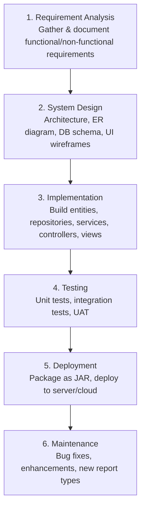
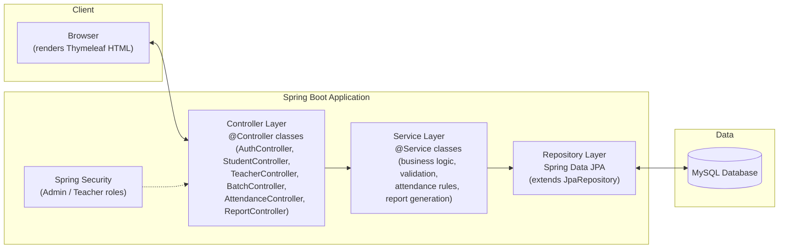
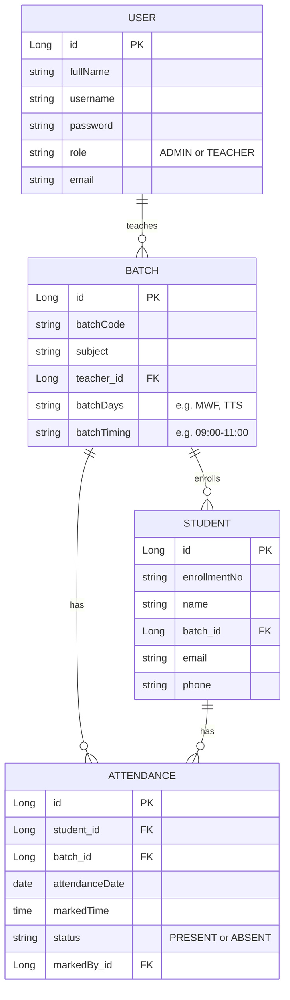

# Attendance Management System — Project Specification

**Tech Stack:** Spring Boot · Thymeleaf · Spring Data JPA · MySQL
**SDLC Model:** Waterfall
**Source:** Requirements adapted from the original project brief (`prj_guide.odt`) and modernized into a web application.

---

## 1. Project Briefing

The Attendance Management System (AMS) is a web application for schools, colleges, and institutes to record and manage daily student attendance. It replaces manual, paper-based attendance registers with a computerized system that lets teachers mark attendance per batch/class and lets admins manage teachers, students, and batches, and generate reports.

### 1.1 Purpose
- Digitize the traditional paper-based attendance process.
- Generate attendance reports on demand (mid-session or end-of-session), not just at term end.
- Provide a learning project that demonstrates a full-stack Spring Boot application with layered architecture, CRUD operations, authentication, and reporting.

### 1.2 Customer Requirements
- User-friendly UI with fast, reliable data storage and retrieval.
- Minimal manual/paper work — all data entered and stored digitally.
- Reports generated on demand, exportable to Excel/PDF.
- Role-based access: **Admin** and **Teacher (User)**.

---

## 2. Functional Requirements

| # | Requirement |
|---|-------------|
| FR1 | Admin and Teacher login with role-based access (Spring Security). |
| FR2 | Admin can Create/Read/Update/Delete **Teachers**. |
| FR3 | Admin can Create/Read/Update/Delete **Students**. |
| FR4 | Admin can Create/Read/Update/Delete **Batches** (batch code, subject, teacher, days, timing). |
| FR5 | Teacher can view only the batches assigned to them. |
| FR6 | Teacher can mark attendance for an individual student or for a whole batch/class on a given date. |
| FR7 | Attendance cannot be marked for a future date. |
| FR8 | Every attendance record stores the date, time, student, batch, and status (Present/Absent). |
| FR9 | Teacher can mark "absentees only" for a batch on a given date. |
| FR10 | Reports: monthly student-wise present/absent report, per-batch report, and custom date-range report. |
| FR11 | Reports exportable to Excel and PDF. |
| FR12 | Admin dashboard shows aggregate stats across all batches/students. |
| FR13 | Every student and teacher has a unique enrollment/employee number. |
| FR14 | Students below 75% attendance are flagged for a notice. |

### 2.1 Non-Functional Requirements
- Passwords stored using BCrypt hashing (not plain text, unlike the legacy stored-procedure approach).
- Input validation on all forms (Bean Validation / Hibernate Validator).
- Layered architecture (Controller → Service → Repository) for maintainability.
- Responsive UI (Thymeleaf + Bootstrap 5).

---

## 3. SDLC — Waterfall Model

This project follows the classic Waterfall model. Each phase completes (with sign-off) before the next begins.



| Phase | Deliverable in this project |
|-------|------------------------------|
| Requirement Analysis | This document, Section 1 & 2 |
| System Design | Section 4 (Architecture), Section 5 (ERD), Section 6 (DB Schema) |
| Implementation | Spring Boot codebase (entities, repos, services, controllers, Thymeleaf templates) |
| Testing | JUnit + Mockito unit tests, manual UAT against Section 2 requirements |
| Deployment | Executable `.jar` via `mvn clean package`, run with `java -jar` or Docker |
| Maintenance | Backlog: SMS/email notices for low attendance, biometric integration, mobile app |

---

## 4. System Architecture

Layered (N-tier) architecture:



**Package structure:**
```
com.ams
 ├── config          # SecurityConfig, WebConfig
 ├── controller       # @Controller (Thymeleaf) classes
 ├── model / entity   # JPA entities
 ├── repository       # Spring Data JPA interfaces
 ├── service          # interfaces
 ├── service.impl     # implementations
 ├── dto              # form-backing objects
 ├── exception        # custom exceptions + global handler
 └── util             # report generation (Excel/PDF), date helpers
```

---

## 5. Entity-Relationship Diagram



---

## 6. Database Schema (MySQL)

```sql
CREATE TABLE users (
    id BIGINT AUTO_INCREMENT PRIMARY KEY,
    full_name VARCHAR(100) NOT NULL,
    username VARCHAR(50) NOT NULL UNIQUE,
    password VARCHAR(255) NOT NULL,
    role VARCHAR(20) NOT NULL, -- ADMIN / TEACHER
    email VARCHAR(100)
);

CREATE TABLE batch (
    id BIGINT AUTO_INCREMENT PRIMARY KEY,
    batch_code VARCHAR(20) NOT NULL UNIQUE,
    subject VARCHAR(100) NOT NULL,
    teacher_id BIGINT,
    batch_days VARCHAR(20),
    batch_timing VARCHAR(20),
    FOREIGN KEY (teacher_id) REFERENCES users(id)
);

CREATE TABLE student (
    id BIGINT AUTO_INCREMENT PRIMARY KEY,
    enrollment_no VARCHAR(30) NOT NULL UNIQUE,
    name VARCHAR(100) NOT NULL,
    batch_id BIGINT,
    email VARCHAR(100),
    phone VARCHAR(15),
    FOREIGN KEY (batch_id) REFERENCES batch(id)
);

CREATE TABLE attendance (
    id BIGINT AUTO_INCREMENT PRIMARY KEY,
    student_id BIGINT NOT NULL,
    batch_id BIGINT NOT NULL,
    attendance_date DATE NOT NULL,
    marked_time TIME NOT NULL,
    status VARCHAR(10) NOT NULL, -- PRESENT / ABSENT
    marked_by BIGINT,
    FOREIGN KEY (student_id) REFERENCES student(id),
    FOREIGN KEY (batch_id) REFERENCES batch(id),
    FOREIGN KEY (marked_by) REFERENCES users(id),
    UNIQUE KEY uniq_attendance (student_id, attendance_date)
);
```

---

## 7. CRUD Modules

| Module | Create | Read | Update | Delete | Notes |
|--------|--------|------|--------|--------|-------|
| Teacher (User, role=TEACHER) | ✅ | ✅ | ✅ | ✅ | Admin only |
| Student | ✅ | ✅ | ✅ | ✅ | Admin only |
| Batch | ✅ | ✅ | ✅ | ✅ | Admin only |
| Attendance | ✅ | ✅ | ✅ (correction, same day) | ❌ (audit trail preserved) | Teacher, restricted to own batches |

---

## 8. Page / Route Map (Thymeleaf, server-rendered)

| Route | Access | Description |
|-------|--------|-------------|
| `/login` | Public | Login form |
| `/admin/dashboard` | ADMIN | Stats overview |
| `/admin/teachers` | ADMIN | List/CRUD teachers |
| `/admin/students` | ADMIN | List/CRUD students |
| `/admin/batches` | ADMIN | List/CRUD batches |
| `/admin/reports` | ADMIN | Generate reports for any batch/student, export Excel/PDF |
| `/teacher/dashboard` | TEACHER | List of assigned batches |
| `/teacher/batches/{id}/attendance` | TEACHER | Mark attendance for a batch on a date |
| `/teacher/batches/{id}/attendance/absentees` | TEACHER | Mark absentees only |
| `/teacher/reports` | TEACHER | Reports scoped to own batches |
| `/teacher/settings` | TEACHER | Change password/profile |

---

## 9. Reports
- Monthly student-wise Present/Absent report.
- Per-batch report for a custom date range.
- Attendance-percentage report flagging students under 75%.
- Export formats: **Excel** (Apache POI) and **PDF** (iText or OpenPDF).

---

## 10. Setup & Run

```bash
# 1. Create the database
mysql -u root -p -e "CREATE DATABASE ams_db;"

# 2. Configure src/main/resources/application.properties
spring.datasource.url=jdbc:mysql://localhost:3306/ams_db
spring.datasource.username=root
spring.datasource.password=yourpassword
spring.jpa.hibernate.ddl-auto=update
spring.thymeleaf.cache=false

# 3. Build and run
mvn clean package
java -jar target/attendance-management-system-0.0.1-SNAPSHOT.jar

# App available at http://localhost:8080/login
```

---

## 11. Future Enhancements (Maintenance Phase)
- Email/SMS auto-notice to students below 75% attendance.
- Biometric / QR-code based attendance capture.
- REST API layer + mobile app.
- Multi-institute (multi-tenant) support.
