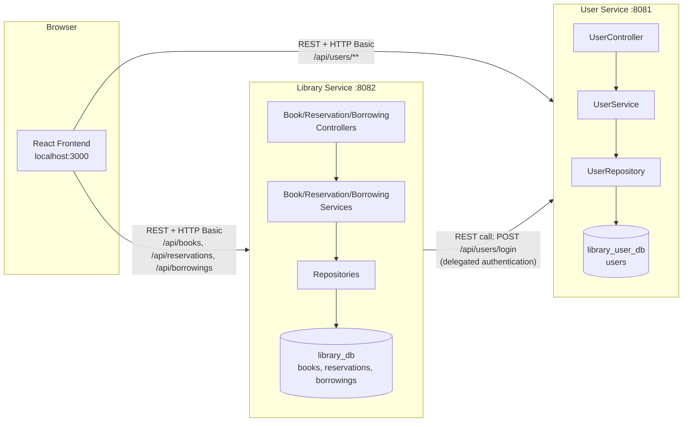
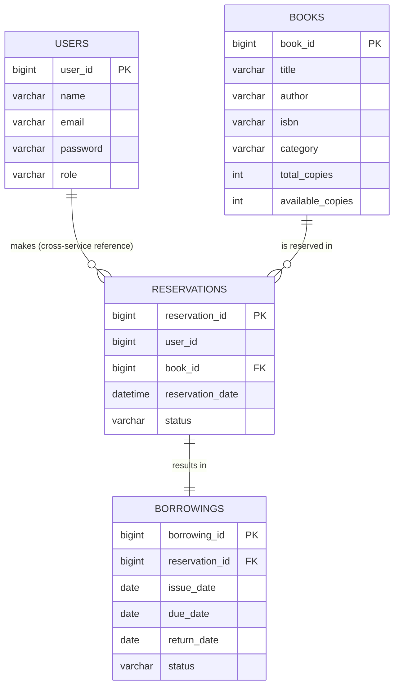

# Library Book Reservation System

A simple, full-stack **Library Book Reservation System** built as a college minor project to demonstrate Spring Boot, microservices, REST APIs, Spring Data JPA/Hibernate, MySQL, and a React frontend.

The project intentionally stays small and explainable: two Spring Boot microservices, one MySQL database per service, and a plain React frontend — no Kafka, Docker, Kubernetes, JWT, Redis, or other infrastructure that a minor project doesn't need.

---

## 1. Project Overview

The system lets **students** search a library's book catalog, check availability, reserve a book, and cancel their own active reservations. **Librarians** manage the book catalog, review and approve reservations, and handle the physical issuing and return of books.

Two roles, one simple workflow:

```
Student reserves a book  →  Librarian approves it  →  Librarian issues it  →  Student returns it
```

---

## 2. Features

**Student**
- Register (always as STUDENT) and log in
- Search/browse the book catalog
- Check book availability
- Reserve an available book
- Cancel an active (PENDING/APPROVED) reservation
- View their own reservation history

**Librarian**
- Log in (account seeded manually / on startup)
- Full CRUD on books
- View and approve reservations
- Issue a book against an approved reservation
- Process a book return
- View borrowing records

**Cross-cutting**
- Role-based authorization enforced on the **backend**, not just hidden UI buttons
- Centralized, meaningful error handling (404 / 400 / 401 / 403 / 409)
- Input validation on important fields (email format, required fields, copy counts)

---

## 3. Technology Stack

| Layer | Technology |
|---|---|
| Backend language | Java 17 |
| Backend framework | Spring Boot 3 |
| Persistence | Spring Data JPA + Hibernate |
| Database | MySQL 8 |
| Build tool | Maven |
| API style | REST (JSON) |
| Security | Spring Security, HTTP Basic Auth, BCrypt password hashing (**no JWT/OAuth**) |
| Frontend | React (functional components + hooks), React Router, Axios |
| Frontend state | Local component state + one small AuthContext (**no Redux**) |

---

## 4. Microservice Architecture

Exactly two microservices, each with its own database, and no API Gateway (skipped deliberately to keep the project simple — see "Design Decisions" below).



### How the two services communicate

The **User Service** owns the `users` table and is the single source of truth for identity — it authenticates its own requests locally via a `UserDetailsService` backed by that table.

The **Library Service** deliberately has **no users table** (avoiding a duplicated, denormalized copy of user data across two databases). Instead, every request to the Library Service is authenticated by a custom `RemoteAuthenticationProvider` that makes a plain REST call — `POST /api/users/login` — to the User Service with the caller's email/password. If the User Service confirms the credentials, the Library Service trusts the returned `userId` and `role` for that request (attached to the Spring Security `Authentication` object) and never trusts a client-supplied user ID.

This is the concrete example of "microservice-to-microservice communication" in this project: a synchronous REST call, made on every authenticated request to the Library Service, using Spring's `RestTemplate`.

Both services run independently (their own JVM process, own port, own database) and the frontend talks to whichever one owns the resource it needs — there's no gateway routing layer.

---

## 5. Database Design

Two databases (one per microservice), normalized, with no redundant tables.

**`library_user_db`** (User Service)

| Table | Columns |
|---|---|
| `users` | `user_id` (PK), `name`, `email` (unique), `password` (BCrypt hash), `role` (`STUDENT`/`LIBRARIAN`) |

**`library_db`** (Library Service)

| Table | Columns |
|---|---|
| `books` | `book_id` (PK), `title`, `author`, `isbn` (unique), `category`, `total_copies`, `available_copies` |
| `reservations` | `reservation_id` (PK), `user_id` (cross-service reference, **not** a DB foreign key), `book_id` (FK → `books`), `reservation_date`, `status` |
| `borrowings` | `borrowing_id` (PK), `reservation_id` (FK → `reservations`, unique), `issue_date`, `due_date`, `return_date`, `status` |

### Entity Relationships



- **User 1 → Many Reservations**: one student can have many reservations, tracked by `user_id` on `reservations`. Because `users` and `reservations` live in different databases (different microservices), this is a logical relationship only — enforced in application code, not a SQL foreign key.
- **Book 1 → Many Reservations**: a real JPA `@ManyToOne`/`@JoinColumn`, since both tables live in `library_db`.
- **Reservation 1 → 1 Borrowing**: a real JPA `@OneToOne`, enforced with a `unique` constraint on `reservations.reservation_id` in the `borrowings` table.

---

## 6. API Endpoints

All error responses share the shape:
```json
{ "timestamp": "...", "status": 404, "error": "Not Found", "message": "Book not found with id: 5" }
```

### User Service (`http://localhost:8081`)

| Method | Endpoint | Access | Description |
|---|---|---|---|
| POST | `/api/users/register` | Public | Register a new STUDENT account |
| POST | `/api/users/login` | Public | Validate credentials, return user info + role |
| GET | `/api/users/{id}` | Owner or LIBRARIAN | Get a user's profile |
| GET | `/api/users` | LIBRARIAN | List all users |
| PUT | `/api/users/{id}` | Owner or LIBRARIAN | Update a profile |
| DELETE | `/api/users/{id}` | LIBRARIAN | Delete a user |

### Library Service (`http://localhost:8082`)

| Method | Endpoint | Access | Description |
|---|---|---|---|
| GET | `/api/books` | Public | List all books |
| GET | `/api/books/{id}` | Public | Get one book |
| GET | `/api/books/search?keyword=java` | Public | Search by title/author/category |
| POST | `/api/books` | LIBRARIAN | Add a book |
| PUT | `/api/books/{id}` | LIBRARIAN | Update a book |
| DELETE | `/api/books/{id}` | LIBRARIAN | Delete a book |
| POST | `/api/reservations` | STUDENT | Reserve a book (`{ "bookId": 1 }`) |
| GET | `/api/reservations` | LIBRARIAN | List all reservations |
| GET | `/api/reservations/user/{userId}` | Owner or LIBRARIAN | A student's reservation history |
| PUT | `/api/reservations/{id}/cancel` | Owner or LIBRARIAN | Cancel an active reservation |
| PUT | `/api/reservations/{id}/approve` | LIBRARIAN | Approve a PENDING reservation |
| POST | `/api/borrowings/issue` | LIBRARIAN | Issue a book (`{ "reservationId": 1 }`) |
| PUT | `/api/borrowings/{id}/return` | LIBRARIAN | Return a book |
| GET | `/api/borrowings` | LIBRARIAN | List all borrowing records |

Every request other than register/login/public book browsing requires **HTTP Basic** credentials (`email` as username, plain-text password over the wire — acceptable for a local minor-project demo; see Design Decisions).

---

## 7. Reservation Workflow

```
Student searches for a book
        ↓
Student checks availability (GET /api/books/{id})
        ↓
Student reserves an available book → POST /api/reservations
        ↓
Reservation created with status PENDING; book.availableCopies -= 1
        ↓
Librarian reviews and approves → PUT /api/reservations/{id}/approve  (status → APPROVED)
        ↓
Librarian issues the book → POST /api/borrowings/issue  (Reservation → ISSUED, Borrowing created as BORROWED)
        ↓
Student returns the book → PUT /api/borrowings/{id}/return
        ↓
Borrowing → RETURNED, Reservation → COMPLETED, book.availableCopies += 1
```

Guardrails enforced by `ReservationService` / `BorrowingService`:
- A reservation cannot be created if `availableCopies == 0` → `BookUnavailableException` (HTTP 409).
- A student cannot hold two active (PENDING/APPROVED/ISSUED) reservations for the *same* book → `DuplicateReservationException` (HTTP 409).
- Only `PENDING` or `APPROVED` reservations can be cancelled; cancelling restores `availableCopies`.
- Only `APPROVED` reservations can be issued; only outstanding (`BORROWED`) loans can be returned.

### Reservation status: `PENDING → APPROVED → CANCELLED / ISSUED → COMPLETED`
### Borrowing status: `BORROWED → RETURNED`

---

## 8. Backend Architecture (per service)

```
Controller  →  Service  →  Repository  →  Entity  →  MySQL
```

- **Controllers** only handle HTTP concerns (request/response, status codes) — no business logic.
- **Services** hold all business rules (availability checks, duplicate checks, status transitions).
- **Repositories** are plain `JpaRepository` interfaces — no hand-written SQL.
- **Entities** are mapped with `@Entity`, `@Id`, `@GeneratedValue`, `@ManyToOne`, `@OneToOne`, `@JoinColumn`.
- **DTOs** decouple the API contract from the JPA entities (e.g. `UserResponse` never exposes the password hash).
- **`@RestControllerAdvice`** (`GlobalExceptionHandler`) turns custom exceptions into consistent JSON error responses.

---

## 9. How to Run the Project

### Prerequisites
- JDK 17+
- Maven 3.8+
- MySQL 8 running locally (default: `root` / `root` — update `application.properties` in each service if different)
- Node.js 18+ and npm

### 1. Start the User Service
```bash
cd user-service
mvn spring-boot:run
```
Runs on `http://localhost:8081`. It auto-creates the `library_user_db` schema/tables (`spring.jpa.hibernate.ddl-auto=update`) and seeds one default LIBRARIAN account on first startup (see credentials below).

### 2. Start the Library Service
```bash
cd library-service
mvn spring-boot:run
```
Runs on `http://localhost:8082`. It auto-creates the `library_db` schema/tables the same way. It needs the User Service to be reachable at `http://localhost:8081` for authentication to work (configurable via `user-service.base-url` in its `application.properties`).

### 3. Start the React frontend
```bash
cd frontend
npm install
npm start
```
Runs on `http://localhost:3000` and talks directly to both services (their base URLs are set in `src/api/client.js`).

### Example login credentials
| Role | Email | Password |
|---|---|---|
| Librarian (seeded automatically) | `librarian@library.com` | `librarian123` |
| Student | Register your own via the "Register" page | — |

---

## 10. Design Decisions

- **No API Gateway.** With only two services and no browser-side routing problem to solve (the React app simply calls each service's own port), a gateway would add configuration and moving parts without teaching anything new for this project's scope.
- **No JWT/OAuth.** The brief calls for "basic authentication" and explicitly excludes JWT. HTTP Basic + BCrypt-hashed passwords satisfies "different permissions for different roles, enforced on the backend" without the added complexity of token issuance/refresh.
- **Library Service has no `users` table.** Storing a second, denormalized copy of user data in the Library Service's database would violate normalization and create a data-sync problem (what happens when a user's password changes?). Instead it delegates authentication to the User Service over REST on every request — a small, deliberate coupling that doubles as the project's microservice-communication example.
- **`userId` on `Reservation` is a plain column, not a JPA relationship.** Cross-database foreign keys aren't possible (and wouldn't be a good idea even with the same DB engine, in a microservices setup) — each service should own and be able to evolve its own schema independently.
- **`availableCopies` is decremented at reservation time, not at issue time.** This matches the stated workflow ("Available copies decrease by 1" appears immediately after "Student reserves an available book") and prevents two students from reserving the same last copy while a librarian is still deciding whether to approve the first request.
