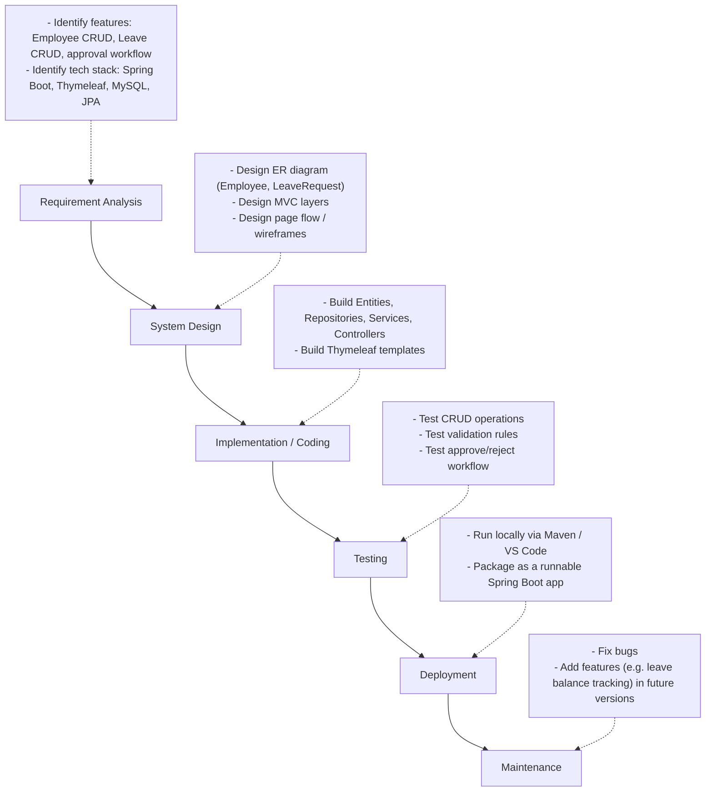
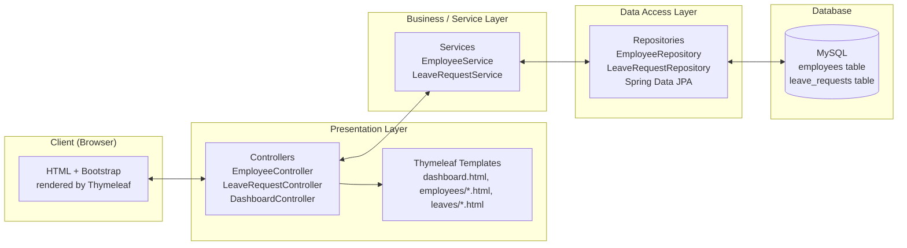
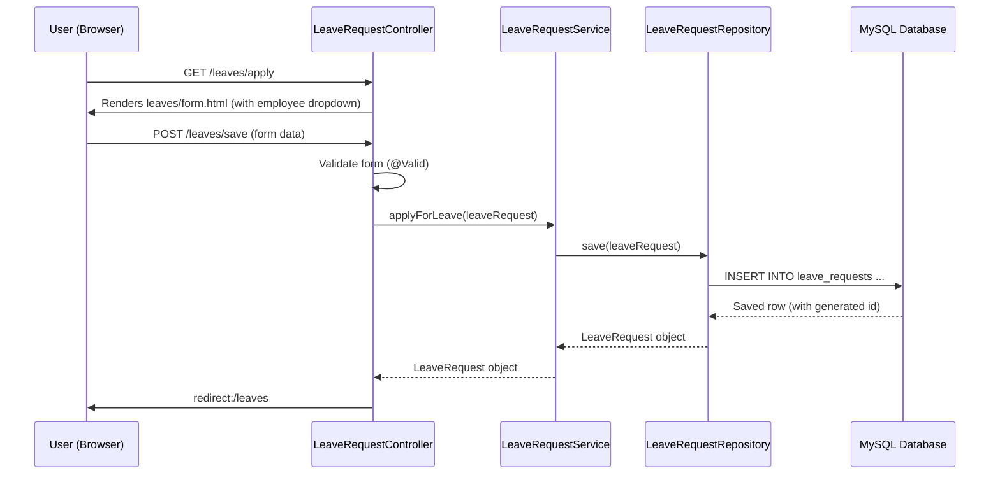

# System Architecture & Design Documentation

## 1. Waterfall Model — Applied to This Project

The Waterfall Model is a linear, sequential software development process where
each phase must be completed before the next begins. This project followed
that process as follows:

### Why Waterfall fits a project like this

* Requirements were fixed and well understood upfront (a standard CRUD + approval
  workflow application) — Waterfall works best when requirements are unlikely to
  change mid-project, which is the case for a capstone/academic project.
* Each phase has a clear, demonstrable deliverable (design docs, working code,
  test results), which maps naturally onto how a capstone project is usually
  evaluated phase by phase.
* Unlike Agile, there's no need for iterative sprints or a changing product
  backlog for a project of this fixed, small scope.

---

## 2. Three-Tier / MVC Architecture

### Layer responsibilities

| Layer | Classes | Responsibility |
|---|---|---|
| Presentation | `*Controller.java`, `templates/*.html` | Handle HTTP requests, pass data to/from templates, no business logic |
| Business/Service | `EmployeeService.java`, `LeaveRequestService.java` | Business rules (e.g. approving/rejecting leave), coordinates repository calls |
| Data Access | `EmployeeRepository.java`, `LeaveRequestRepository.java` | Talk to the database via Spring Data JPA — no manual SQL needed |
| Entity/Model | `Employee.java`, `LeaveRequest.java`, `LeaveStatus.java` | Represent database tables as Java objects (ORM mapping) |

---

## 3. Request Flow Example — Applying for Leave

