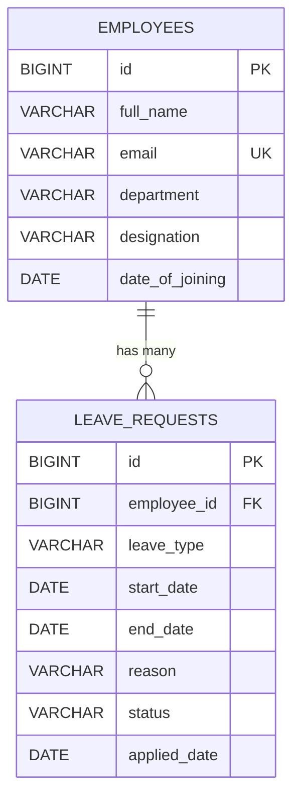

# Database Design

## 1. Entity-Relationship Diagram



**Relationship:** One `employee` can submit many `leave_requests`, but each
`leave_request` belongs to exactly one `employee`. This is a classic
**One-to-Many** relationship, implemented via a foreign key
(`leave_requests.employee_id` → `employees.id`).

In the Java code, this maps to:
* `Employee.java` — `@OneToMany(mappedBy = "employee")` (the "one" side)
* `LeaveRequest.java` — `@ManyToOne` + `@JoinColumn(name = "employee_id")` (the "many"/owning side)

---

## 2. Table Definitions (auto-generated by Hibernate from the entities)

### `employees`

| Column | Type | Constraints |
|---|---|---|
| id | BIGINT | PRIMARY KEY, AUTO_INCREMENT |
| full_name | VARCHAR(100) | NOT NULL |
| email | VARCHAR(100) | NOT NULL, UNIQUE |
| department | VARCHAR(50) | NOT NULL |
| designation | VARCHAR(50) | NOT NULL |
| date_of_joining | DATE | |

### `leave_requests`

| Column | Type | Constraints |
|---|---|---|
| id | BIGINT | PRIMARY KEY, AUTO_INCREMENT |
| employee_id | BIGINT | NOT NULL, FOREIGN KEY → employees(id) |
| leave_type | VARCHAR(30) | NOT NULL |
| start_date | DATE | NOT NULL |
| end_date | DATE | NOT NULL |
| reason | VARCHAR(255) | |
| status | VARCHAR(20) | NOT NULL (PENDING / APPROVED / REJECTED) |
| applied_date | DATE | |

---

## 3. Database Normalization

The schema is normalized up to **Third Normal Form (3NF)**:

**1NF (First Normal Form)** — every column holds a single, atomic value (no
lists or repeating groups stuffed into one column). For example, we don't
store multiple leave dates in a single comma-separated column — every leave
application is its own row in `leave_requests`.

**2NF (Second Normal Form)** — every non-key column depends on the *whole*
primary key, and both tables use a single-column surrogate primary key
(`id`), so there are no partial-dependency issues to begin with.

**3NF (Third Normal Form)** — no non-key column depends on another non-key
column (no transitive dependency). For example, `department` and
`designation` describe the *employee*, not the *leave request*, so they live
only in the `employees` table — `leave_requests` only stores a reference
(`employee_id`) rather than repeating the employee's department/designation
on every leave row. This avoids **data duplication and update anomalies**:
if an employee changes department, we update one row in `employees`, not
every leave request they've ever filed.

### Why this matters (for viva)

If we had **not** normalized the design — for example, by storing
`employee_name`, `department`, and `designation` directly inside every row of
`leave_requests` — then:
* The same employee's details would be duplicated across many leave rows
  (wasted storage).
* Updating an employee's department would require updating every one of
  their leave request rows too (update anomaly).
* Deleting an employee's last leave request could accidentally lose their
  only record of department/designation (deletion anomaly).

Splitting into two related tables with a foreign key avoids all three
problems — this is the entire point of normalization.

---

## 4. The JOIN in Action

Whenever the app needs to show a leave request together with the employee's
name (e.g. on the `/leaves` list page), Hibernate performs a SQL JOIN behind
the scenes:

```sql
SELECT lr.*, e.full_name, e.department
FROM leave_requests lr
JOIN employees e ON lr.employee_id = e.id;
```

This exact JOIN is what powers:
* `leaves/list.html` — showing `leave.employee.fullName` for every request
* `employees/view.html` — showing every leave request belonging to one employee

You never write this SQL by hand — Spring Data JPA / Hibernate generates it
automatically from the `@ManyToOne` / `@OneToMany` annotations on the
entities. You can see the generated SQL in the console at runtime because
`spring.jpa.show-sql=true` is enabled in `application.properties`.

---

## 5. Sample Data

The project ships with `src/main/resources/data.sql`, which auto-loads 5
sample employees and 6 sample leave requests (spanning all three statuses:
PENDING, APPROVED, REJECTED) every time the app starts, so the dashboard and
list pages have real data to show immediately — no manual data entry needed
before your first demo/viva run.
